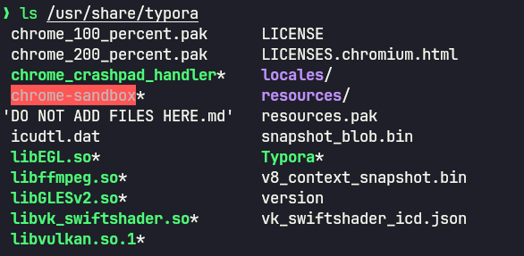
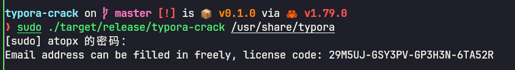
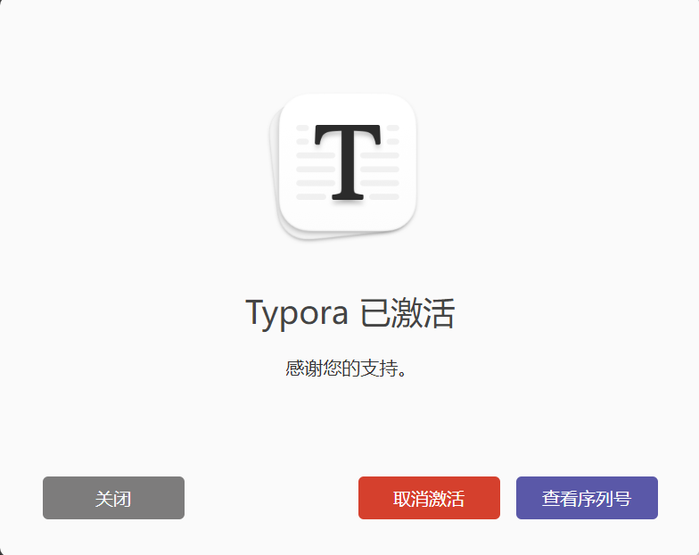

# 自行构建使用

> rust 1.70+

测试通过: linux mint21.3 / win11 / macos13


# Setup-1 Build

```sh
cargo build --release
``` 

# Setup-2 Find installed path

> 找到 Typora 的安装路径, 自行替换路径




# Setup-3 Crack

```sh
# windows
.\target\release\typora-crack.exe C:\app\Typora

# linux
sudo ./target/release/typora-crack /usr/share/typora
```



# Successful
> Email can be filled in freely, then input crack license code.




